# Allay

<p>
  <a href="LICENSE"></a>
  
  
  
  
</p>

> An @enchanted-plugins product — algorithm-driven, agent-managed, self-learning.

The context health platform that learns what wastes your tokens — and stops it.

**3 plugins. 9 algorithms. 4 agents. Honest numbers.**

> 40 minutes into a session, Allay told me Claude had been editing and reverting
> the same file for 12 minutes. I didn't notice. It did.

---

## Origin

Allay takes its name from the **allay mob in Minecraft** — a small winged creature that follows you, collects items matching what you show it, and drops the rest. Allay does the same with your session: keeps the signal, drops the duplicates, stops the runaway loops.

The question this plugin answers: *What did I spend?*

## Contents

- [How It Works](#how-it-works)
- [What Makes Allay Different](#what-makes-allay-different)
- [The Full Lifecycle](#the-full-lifecycle)
- [Install](#install)
- [3 Plugins, 4 Agents, 9 Algorithms](#3-plugins-4-agents-9-algorithms)
- [What You Get Per Session](#what-you-get-per-session)
- [The Science Behind Allay](#the-science-behind-allay)
- [Commands](#commands)
- [Compression Rules (15)](#compression-rules-15)
- [vs Everything Else](#vs-everything-else)
- [Agent Conduct (9 Modules)](#agent-conduct-9-modules)
- [Architecture](#architecture)
- [Contributing](#contributing)
- [License](#license)

## How It Works

Allay splits into three plugins that each own one lifecycle phase. **token-saver** fires on `PreToolUse` to compress verbose Bash output (A3), block duplicate file reads (A5), and return deltas on changed re-reads (A6). **context-guard** fires on `PostToolUse` to forecast runway (A2) and detect drift patterns (A1). **state-keeper** fires on `PreCompact` to write an atomic checkpoint (A4). Across sessions, A7 accumulates per-strategy success rates. The diagram below shows this flow.

<p align="center">
  <a href="docs/assets/hooks.mmd" title="View hook-binding diagram source (Mermaid)">
    
  </a>
</p>

<sub align="center">

Source: [docs/assets/hooks.mmd](docs/assets/hooks.mmd) · Regeneration command in [docs/assets/README.md](docs/assets/README.md).

</sub>

Three plugins. Three lifecycle phases. No overlap. No dependencies between plugins.

## What Makes Allay Different

### Drift Alert

Catches Claude spinning in circles — in real time, not after the fact:

```
⚠️ Drift Alert: src/auth.ts read 4× without changes.
Claude may be stuck re-reading without progress.
→ Reframe the problem or /allay:checkpoint before /compact.
```

Three patterns: **read loops**, **edit-revert cycles**, **test fail loops**.
5-turn cooldown between alerts to avoid noise.

### Token Runway

Not "43% context used." Not "$0.12 spent."
Just: **"~8 turns until compaction."**

```
RUNWAY FORECAST (Algorithm A2: Linear Runway Forecasting)

Point estimate:  ~14 turns remaining
95% CI:          [8, 20] turns
Confidence:      MEDIUM (CV=0.31)
Velocity:        4,200 tokens/turn avg (sigma=1,302)
```

### Per-Tool Analytics

See exactly where your tokens go:

```
TOOL ANALYTICS (this session)
  Read:    42 calls, ~18,400 tokens (34%)
  Bash:    28 calls, ~14,200 tokens (26%)
  Write:   15 calls, ~11,800 tokens (22%)
```

### Output Efficiency

Configurable terse mode that cuts output token waste without losing information.
Four levels: off / lite / full / ultra. Code stays verbose — only prose gets lean.

### Delta Mode

Re-reading a changed file? Allay shows only what changed instead of the full file.
Re-reading an unchanged file? Blocked — with a preview and elapsed time.

### Self-Learning

Allay accumulates strategy success rates across sessions. After each report,
it logs which compression rules fired, which drift patterns recurred, and which
interventions worked — then adjusts its internal model via exponential moving average.

### The Receipt

`/allay:report` shows exact savings per feature, drift alerts fired, turns
remaining, and accumulated learnings. Conservative methodology. We don't inflate numbers.

## The Full Lifecycle

Every turn cycles through the same path. Tool calls hit `PreToolUse` (token-saver), then execute, then hit `PostToolUse` (context-guard). When context approaches full, `PreCompact` fires and state-keeper writes `checkpoint.md` before the wipe. On resume, the restorer agent reads the checkpoint back and the session continues without manual re-briefing.

<p align="center">
  <a href="docs/assets/lifecycle.mmd" title="View session-lifecycle diagram source (Mermaid)">
    
  </a>
</p>

<sub align="center">

Source: [docs/assets/lifecycle.mmd](docs/assets/lifecycle.mmd) · Regeneration command in [docs/assets/README.md](docs/assets/README.md).

</sub>

Every tool call flows through the same pipeline. When context fills up, state-keeper saves a checkpoint before the wipe, and the restorer agent brings it back autonomously.

## Install

Allay ships as 3 plugins cooperating across PreToolUse / PostToolUse / PreCompact. One meta-plugin — `full` — lists all three as dependencies, so a single install pulls in the whole platform.

**In Claude Code** (recommended):

```
/plugin marketplace add enchanted-plugins/allay
/plugin install full@allay
```

Claude Code resolves the dependency list and installs all 3 plugins. Verify with `/plugin list`.

**Want to cherry-pick?** Individual plugins are still installable by name — e.g. `/plugin install allay-context-guard@allay` if you only want the drift/runway dashboard. The three lifecycle phases are designed to cooperate, though, so `full@allay` is the path we recommend.

**Via shell** (also installs `shared/*.sh` locally so hooks work offline):

```bash
bash <(curl -s https://raw.githubusercontent.com/enchanted-plugins/allay/main/install.sh)
```

## 3 Plugins, 4 Agents, 9 Algorithms

| Plugin | Hook | Command | Algorithms |
|--------|------|---------|------------|
| state-keeper | PreCompact | `/allay:checkpoint` | A4 |
| token-saver | PreToolUse + PostToolUse | — | A3, A5, A6 |
| context-guard | PostToolUse | `/allay:report` | A1, A2, A8 |
| shared | — | — | A7, A9 |

| Agent | Model | Plugin | What |
|-------|-------|--------|------|
| analyst | Haiku | context-guard | Background report generation |
| forecaster | Haiku | context-guard | Runway forecast with confidence interval |
| restorer | Haiku | state-keeper | Autonomous context restoration |
| compressor | Haiku | token-saver | Compression strategy analysis |

## What You Get Per Session

Tool calls write events to three plugin state directories. `token-saver/state/metrics.jsonl` records compressions, dedup blocks, and delta reads. `context-guard/state/metrics.jsonl` records per-turn token estimates and drift detections; `learnings.json` accumulates cross-session strategy rates (A7). `state-keeper/state/` holds the latest `checkpoint.md`, any user-flagged `remember.md`, and checkpoint events. `/allay:report` reads all three plugins to produce the session dashboard.

<p align="center">
  <a href="docs/assets/state-flow.mmd" title="View state-flow diagram source (Mermaid)">
    
  </a>
</p>

<sub align="center">

Source: [docs/assets/state-flow.mmd](docs/assets/state-flow.mmd) · Regeneration command in [docs/assets/README.md](docs/assets/README.md).

</sub>

```
state-keeper/state/
├── checkpoint.md        # Pre-compaction snapshot (branch, files, instructions)
├── remember.md          # User-flagged context (/allay:checkpoint items)
└── metrics.jsonl        # checkpoint_saved events

token-saver/state/
└── metrics.jsonl        # bash_compressed, duplicate_blocked, delta_read events

context-guard/state/
├── metrics.jsonl        # turn events — now include "skill" field (A8)
├── skill-metrics.jsonl  # A8 — rich per-skill events (only when a skill is active)
├── active-skills.json   # A8 — live scope stack (invocation-id keyed)
└── .session             # A9 — per-worktree session id (gitignored)

$XDG_STATE_HOME/allay/<repo_id>/       # A9 — cross-worktree global
└── skill-metrics-global.<pid>.jsonl   # per-PID shard; readers glob + merge

$XDG_DATA_HOME/allay/<repo_id>/        # A9 — long-lived learnings
└── learnings.json                     # A7 strategy rates; migrated from local
```

## The Science Behind Allay

Nine named algorithms. Each one referenced in code, agents, and reports.

### A1. Markov Drift Detection

Pattern-matching finite automaton over tool call sequences.

States: `PRODUCTIVE`, `READ_LOOP`, `EDIT_REVERT`, `TEST_FAIL_LOOP`.
Transitions on tool name + file hash + exit code.
5-turn cooldown between alerts.

<p align="center">= theta; else 0"></p>

Where θ = 3 (configurable via `ALLAY_DRIFT_READ_THRESHOLD`).

### A2. Linear Runway Forecasting

Estimates turns until compaction from a sliding window of token velocities.

<p align="center"></p>

Where C_max = 200,000 tokens and t̄_w is the windowed mean of recent turns.

### A3. Shannon Compression

Reduces output $O$ to $O'$ preserving information density above threshold $\theta$:

<p align="center">= theta · H(O); theta = 1.0 code, 0.7 tests, 0.3 logs"></p>

15 pattern-matched rules for input compression. Extensions:
- **Shannon Output Compression** — prose terse mode (4 levels)
- **Temporal Decay Compression** — age-based result stubbing

### A4. Atomic State Serialization

Write-validate-rename protocol for checkpoint persistence.

<p align="center"> validate(tmp) -> rename(tmp, target)"></p>

50KB bound. Atomic `mkdir` locking (never `flock`).

### A5. Content-Addressable Dedup

SHA-256 hash + TTL cache for read deduplication.

<p align="center">= TTL"></p>

TTL = 600s. Block unchanged, allow after expiry.

### A6. Content-Addressable Delta

Extension of A5. Third decision path for changed files:

<p align="center"></p>

Returns unified diff with 3 context lines instead of full file content.
Only activates when diff is smaller than half the full file.

### A7. Bayesian Strategy Accumulation

Exponential moving average over compression strategy success rates across sessions.

<p align="center"></p>

Detects dormant rules, chronic drift patterns, and velocity drift.
Persisted to `learnings.json` after each report.

### A8. Skill-Scoped Attribution

Every tool call is attributed to the currently-active skill (or `manual`
if none is registered). Skills register a scope at entry, unregister at exit;
the stack supports nesting so a parent skill that invokes a child skill still
has correct parent/child lineage on every event.

<p align="center"></p>

Where $S$ is the stack of active skills (LIFO), $s_{\text{top}}$ is the most
recent, and $\text{TTL} = 3600\text{s}$ (configurable via `ALLAY_SKILL_TTL`).
Scopes are keyed by 16-hex-char invocation ids — not PIDs — so entries survive
PID reuse (systemd `InvocationID` pattern). Eviction on every read: stale
entries (dead PID or expired TTL) are purged before the "current" scope is returned.

Emitted as `skill-metrics.jsonl` alongside `metrics.jsonl`. `/allay:analytics`
surfaces the per-skill breakdown.

### A9. Worktree Session Graph

Concurrent Claude Code sessions across multiple git worktrees of the same repo
are unified into one view by the root-commit hash:

<p align="center"></p>

The root commit is stable across clones, forks, renames, and worktree paths —
basename-of-toplevel is not. Cross-worktree events land in
`$XDG\_STATE\_HOME/allay/\langle repo\_id\rangle/`, sharded per-PID
(`skill-metrics-global.\langle pid\rangle.jsonl`) to avoid concurrent-append
interleaving on filesystems without atomicity guarantees (Windows, NFS).
Readers glob all shards and merge by `ts`:

<p align="center"></p>

`/allay:report` renders a WORKTREE OVERVIEW section when ≥ 2 worktrees have
written. `/allay:report --global` forces the unified view across every session
recorded in the global dir.

Learnings (A7) also migrate to `$XDG_DATA_HOME/allay/<repo_id>/learnings.json` —
the data dir per XDG spec — so cross-session accumulation survives cache wipes
and spans every worktree without symlinks.

## Commands

| Command | Plugin | What |
|---------|--------|------|
| `/allay:report` | context-guard | Full session dashboard. `--global` for unified cross-worktree view (A9). |
| `/allay:runway` | context-guard | Quick turns-until-compaction check |
| `/allay:analytics` | context-guard | Per-tool + per-skill token breakdown (A8) |
| `/allay:doctor` | context-guard | Diagnostic self-check for all plugins |
| `/allay:checkpoint [text]` | state-keeper | Save context that survives compaction |
| `/allay:checkpoint-show` | state-keeper | Display most recent automatic checkpoint |

## Compression Rules (15)

| Pattern | Action |
|---------|--------|
| npm/yarn/pnpm test, vitest, jest | `tail -n 40` |
| pytest, python -m unittest | filter pass/fail summary |
| go test | filter PASS/FAIL lines |
| mvn/gradle test | filter BUILD + test summary |
| dotnet build/test | filter pass/fail summary |
| npm/yarn/pnpm install | filter errors/warnings |
| cargo build/test | filter errors/warnings |
| make | filter errors or "Build succeeded" |
| docker build | filter layer summaries + image ID |
| terraform plan | filter Plan summary |
| eslint | filter error count + first errors |
| tsc | filter TS errors |
| git log (verbose) | `--oneline -20` |
| find (no head) | `head -n 30` |
| cat (>100 lines) | `head -n 80` + line count |

Bypass: prefix with `FULL:` to skip compression.

## vs Everything Else

| | Allay | Caveman | Cozempic | context-mode | token-optimizer |
|---|---|---|---|---|---|
| Drift detection | real-time, 3 patterns | — | — | — | — |
| Turn forecast | Runway + 95% CI | — | threshold only | — | — |
| Output reduction | 4 modes | 65% prose cut | — | — | — |
| Input compression | 15 rules | — | 18 strategies | — | — |
| Delta mode | diff on re-read | — | — | — | delta mode |
| Per-skill + per-tool analytics | /allay:analytics (A8) | — | — | per-tool only | waste dashboard |
| Cross-worktree unified view | /allay:report --global (A9) | — | — | — | — |
| Tool result aging | age-based alerts | — | 3-tier stubbing | — | — |
| Savings proof | /allay:report | — | session report | ctx_stats | quality score |
| Compaction survival | checkpoint.md | — | team state | SQLite | checkpoints |
| Self-learning | learnings.json | — | — | — | — |
| Agents | 4 (Haiku) | — | — | — | — |
| Dependencies | bash + jq | — | Python | Node.js + MCP | Node.js |

Combined: 30-45% token reduction. Not 70%. Honest numbers.
Plus the only tool that catches Claude going in circles — and learns from it.

## Agent Conduct (9 Modules)

Every skill inherits a reusable behavioral contract from [shared/](shared/) — loaded once into [CLAUDE.md](CLAUDE.md), applied across all plugins. This is how Claude *acts* inside Allay: deterministic, surgical, verifiable. Not a suggestion; a contract.

| Module | What it governs |
|--------|-----------------|
| [discipline.md](shared/conduct/discipline.md) | Coding conduct: think-first, simplicity, surgical edits, goal-driven loops |
| [context.md](shared/conduct/context.md) | Attention-budget hygiene, U-curve placement, checkpoint protocol |
| [verification.md](shared/conduct/verification.md) | Independent checks, baseline snapshots, dry-run for destructive ops |
| [delegation.md](shared/conduct/delegation.md) | Subagent contracts, tool whitelisting, parallel vs. serial rules |
| [failure-modes.md](shared/conduct/failure-modes.md) | 14-code taxonomy for accumulated-learning logs |
| [tool-use.md](shared/conduct/tool-use.md) | Tool-choice hygiene, error payload contract, parallel-dispatch rules |
| [skill-authoring.md](shared/conduct/skill-authoring.md) | SKILL.md frontmatter discipline, discovery test |
| [hooks.md](shared/conduct/hooks.md) | Advisory-only hooks, injection over denial, fail-open |
| [precedent.md](shared/conduct/precedent.md) | Log self-observed failures to `state/precedent-log.md`; consult before risky steps |

## Architecture

Full interactive architecture explorer with 4 tabbed diagrams and plugin component cards:

**[docs/architecture/](docs/architecture/)** — auto-generated from the codebase. Run `python docs/architecture/generate.py` to regenerate.

## Contributing

See [CONTRIBUTING.md](CONTRIBUTING.md)

## License

MIT
