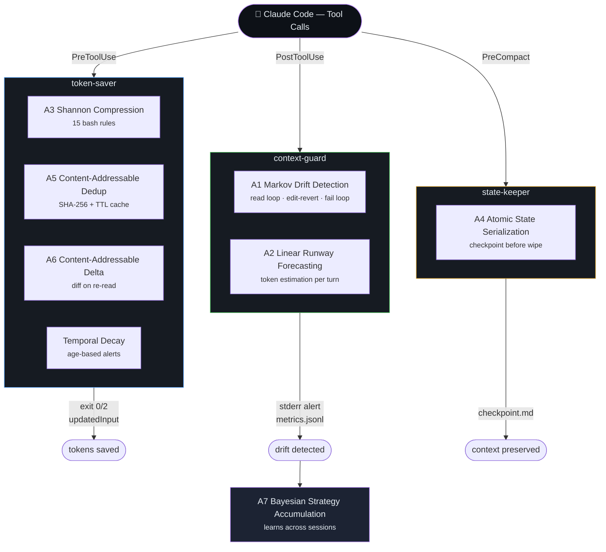
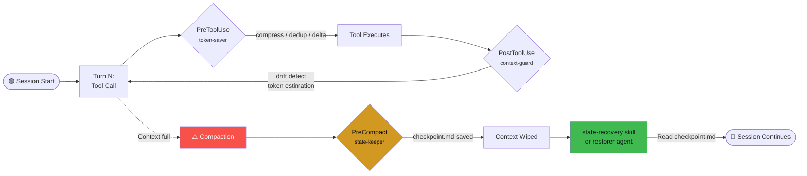
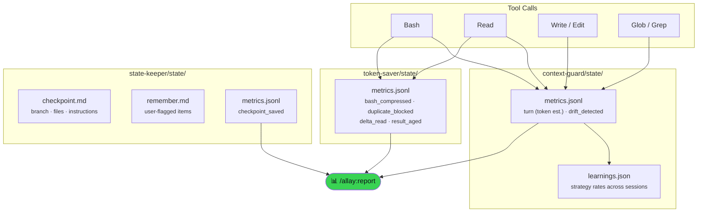

# Allay

> An @enchanted-plugins product — algorithm-driven, agent-managed, self-learning.

The context health platform that learns what wastes your tokens — and stops it.

**3 plugins. 7 algorithms. 4 agents. Honest numbers.**

> 40 minutes into a session, Allay told me Claude had been editing and reverting
> the same file for 12 minutes. I didn't notice. It did.

---

## Contents

- [How It Works](#how-it-works)
- [What Makes Allay Different](#what-makes-allay-different)
- [Session Lifecycle](#session-lifecycle)
- [The Science Behind Allay](#the-science-behind-allay)
- [Install](#install)
- [3 Plugins, 4 Agents, 7 Algorithms](#3-plugins-4-agents-7-algorithms)
- [What You Get Per Session](#what-you-get-per-session)
- [Commands](#commands)
- [Compression Rules (15)](#compression-rules-15)
- [vs Everything Else](#vs-everything-else)
- [Architecture](#architecture)
- [Contributing](#contributing)
- [License](#license)

## How It Works

Allay splits into three plugins that each own one lifecycle phase. **token-saver** fires on `PreToolUse` to compress verbose Bash output (A3), block duplicate file reads (A5), and return deltas on changed re-reads (A6). **context-guard** fires on `PostToolUse` to forecast runway (A2) and detect drift patterns (A1). **state-keeper** fires on `PreCompact` to write an atomic checkpoint (A4). Across sessions, A7 accumulates per-strategy success rates. The diagram below shows this flow.



Three plugins. Three lifecycle phases. No overlap. No dependencies between plugins.

## What Makes Allay Different

### Drift Alert

Catches Claude spinning in circles — in real time, not after the fact:

```
⚠️ Drift Alert: src/auth.ts read 4× without changes.
Claude may be stuck re-reading without progress.
→ Reframe the problem or /allay:checkpoint before /compact.
```

Three patterns: **read loops**, **edit-revert cycles**, **test fail loops**.
5-turn cooldown between alerts to avoid noise.

### Token Runway

Not "43% context used." Not "$0.12 spent."
Just: **"~8 turns until compaction."**

```
RUNWAY FORECAST (Algorithm A2: Linear Runway Forecasting)

Point estimate:  ~14 turns remaining
95% CI:          [8, 20] turns
Confidence:      MEDIUM (CV=0.31)
Velocity:        4,200 tokens/turn avg (sigma=1,302)
```

### Per-Tool Analytics

See exactly where your tokens go:

```
TOOL ANALYTICS (this session)
  Read:    42 calls, ~18,400 tokens (34%)
  Bash:    28 calls, ~14,200 tokens (26%)
  Write:   15 calls, ~11,800 tokens (22%)
```

### Output Efficiency

Configurable terse mode that cuts output token waste without losing information.
Four levels: off / lite / full / ultra. Code stays verbose — only prose gets lean.

### Delta Mode

Re-reading a changed file? Allay shows only what changed instead of the full file.
Re-reading an unchanged file? Blocked — with a preview and elapsed time.

### Self-Learning

Allay accumulates strategy success rates across sessions. After each report,
it logs which compression rules fired, which drift patterns recurred, and which
interventions worked — then adjusts its internal model via exponential moving average.

### The Receipt

`/allay:report` shows exact savings per feature, drift alerts fired, turns
remaining, and accumulated learnings. Conservative methodology. We don't inflate numbers.

## Session Lifecycle

Every turn cycles through the same path. Tool calls hit `PreToolUse` (token-saver), then execute, then hit `PostToolUse` (context-guard). When context approaches full, `PreCompact` fires and state-keeper writes `checkpoint.md` before the wipe. On resume, the restorer agent reads the checkpoint back and the session continues without manual re-briefing.



Every tool call flows through the same pipeline. When context fills up, state-keeper saves a checkpoint before the wipe, and the restorer agent brings it back autonomously.

---

## The Science Behind Allay

Seven named algorithms. Each one referenced in code, agents, and reports.

### A1. Markov Drift Detection

Pattern-matching finite automaton over tool call sequences.

States: `PRODUCTIVE`, `READ_LOOP`, `EDIT_REVERT`, `TEST_FAIL_LOOP`.
Transitions on tool name + file hash + exit code.
5-turn cooldown between alerts.

$$P(\text{drift} \mid s_1, \dots, s_n) = \begin{cases} 1 & \text{if } |\{s_i = s_j\}| \geq \theta \\ 0 & \text{otherwise} \end{cases}$$

Where $\theta = 3$ (configurable via `ALLAY_DRIFT_READ_THRESHOLD`).

### A2. Linear Runway Forecasting

Estimates turns until compaction from a sliding window of token velocities.

$$\hat{R} = \frac{C_{max} - \sum_{i=1}^{n} t_i}{\bar{t}_w}, \quad \text{CI}_{95} = \hat{R} \pm 1.96 \cdot \frac{\sigma_t}{\bar{t}_w} \cdot \hat{R}$$

Where $C_{max} = 200{,}000$ tokens and $\bar{t}_w$ is the windowed mean of recent turns.

### A3. Shannon Compression

Reduces output $O$ to $O'$ preserving information density above threshold $\theta$:

$$H(O') \geq \theta \cdot H(O), \quad \theta = \begin{cases} 1.0 & \text{code} \\ 0.7 & \text{tests} \\ 0.3 & \text{logs} \end{cases}$$

15 pattern-matched rules for input compression. Extensions:
- **Shannon Output Compression** — prose terse mode (4 levels)
- **Temporal Decay Compression** — age-based result stubbing

### A4. Atomic State Serialization

Write-validate-rename protocol for checkpoint persistence.

$$\text{write}(tmp) \rightarrow \text{validate}(tmp) \rightarrow \text{rename}(tmp, target)$$

50KB bound. Atomic `mkdir` locking (never `flock`).

### A5. Content-Addressable Dedup

SHA-256 hash + TTL cache for read deduplication.

$$\text{decision}(f) = \begin{cases} \text{BLOCK} & h(f) = h_{cached} \land \Delta t < \text{TTL} \\ \text{ALLOW} & \Delta t \geq \text{TTL} \end{cases}$$

TTL = 600s. Block unchanged, allow after expiry.

### A6. Content-Addressable Delta

Extension of A5. Third decision path for changed files:

$$\text{decision}(f) = \text{DELTA} \quad \text{when } h(f) \neq h_{cached} \land \Delta t < \text{TTL}$$

Returns unified diff with 3 context lines instead of full file content.
Only activates when diff is smaller than half the full file.

### A7. Bayesian Strategy Accumulation

Exponential moving average over compression strategy success rates across sessions.

$$r_{new} = \alpha \cdot s_{current} + (1 - \alpha) \cdot r_{prior}, \quad \alpha = 0.3$$

Detects dormant rules, chronic drift patterns, and velocity drift.
Persisted to `learnings.json` after each report.

---

## Install

Allay is a **bundle** — all 3 plugins install together. They cooperate at runtime (context-guard watches drift/tokens, state-keeper checkpoints before compaction, token-saver compresses to extend runway), so every plugin lists the other two as dependencies. Claude Code resolves the whole set from one install.

**In Claude Code** (recommended):

```
/plugin marketplace add enchanted-plugins/allay
/plugin install allay-context-guard@allay
```

The second command installs all 3 via auto-resolved dependencies. Any of the 3 names works (`allay-state-keeper@allay`, `allay-token-saver@allay`) — they're peers. `context-guard` is the natural entry point since it's the one you'll feel first. Verify with `/plugin list` — you should see all 3.

**Via shell** (also installs `shared/*.sh` locally so hooks work offline):

```bash
bash <(curl -s https://raw.githubusercontent.com/enchanted-plugins/allay/main/install.sh)
```

> **Why no à la carte?** Installing only `context-guard` would surface drift alerts but leave compactions unchecked; installing only `token-saver` would compress outputs but give you no visibility into what it saved. The platform is the product.

## 3 Plugins, 4 Agents, 7 Algorithms

| Plugin | Hook | Command | Algorithms |
|--------|------|---------|------------|
| state-keeper | PreCompact | `/allay:checkpoint` | A4 |
| token-saver | PreToolUse + PostToolUse | — | A3, A5, A6 |
| context-guard | PostToolUse | `/allay:report` | A1, A2 |
| shared | — | — | A7 |

| Agent | Model | Plugin | What |
|-------|-------|--------|------|
| analyst | Haiku | context-guard | Background report generation |
| forecaster | Haiku | context-guard | Runway forecast with confidence interval |
| restorer | Haiku | state-keeper | Autonomous context restoration |
| compressor | Haiku | token-saver | Compression strategy analysis |

## What You Get Per Session

Tool calls write events to three plugin state directories. `token-saver/state/metrics.jsonl` records compressions, dedup blocks, and delta reads. `context-guard/state/metrics.jsonl` records per-turn token estimates and drift detections; `learnings.json` accumulates cross-session strategy rates (A7). `state-keeper/state/` holds the latest `checkpoint.md`, any user-flagged `remember.md`, and checkpoint events. `/allay:report` reads all three plugins to produce the session dashboard.



```
state-keeper/state/
├── checkpoint.md        # Pre-compaction snapshot (branch, files, instructions)
├── remember.md          # User-flagged context (/allay:checkpoint items)
└── metrics.jsonl        # checkpoint_saved events

token-saver/state/
└── metrics.jsonl        # bash_compressed, duplicate_blocked, delta_read events

context-guard/state/
├── metrics.jsonl        # turn (token est.), drift_detected events
└── learnings.json       # Accumulated strategy rates across sessions (A7)
```

## Commands

| Command | Plugin | What |
|---------|--------|------|
| `/allay:report` | context-guard | Full session dashboard (Runway > Drift > Savings > Learnings) |
| `/allay:runway` | context-guard | Quick turns-until-compaction check |
| `/allay:analytics` | context-guard | Per-tool token consumption breakdown |
| `/allay:doctor` | context-guard | Diagnostic self-check for all plugins |
| `/allay:checkpoint [text]` | state-keeper | Save context that survives compaction |
| `/allay:checkpoint-show` | state-keeper | Display most recent automatic checkpoint |

## Compression Rules (15)

| Pattern | Action |
|---------|--------|
| npm/yarn/pnpm test, vitest, jest | `tail -n 40` |
| pytest, python -m unittest | filter pass/fail summary |
| go test | filter PASS/FAIL lines |
| mvn/gradle test | filter BUILD + test summary |
| dotnet build/test | filter pass/fail summary |
| npm/yarn/pnpm install | filter errors/warnings |
| cargo build/test | filter errors/warnings |
| make | filter errors or "Build succeeded" |
| docker build | filter layer summaries + image ID |
| terraform plan | filter Plan summary |
| eslint | filter error count + first errors |
| tsc | filter TS errors |
| git log (verbose) | `--oneline -20` |
| find (no head) | `head -n 30` |
| cat (>100 lines) | `head -n 80` + line count |

Bypass: prefix with `FULL:` to skip compression.

## vs Everything Else

| | Allay | Caveman | Cozempic | context-mode | token-optimizer |
|---|---|---|---|---|---|
| Drift detection | real-time, 3 patterns | — | — | — | — |
| Turn forecast | Runway + 95% CI | — | threshold only | — | — |
| Output reduction | 4 modes | 65% prose cut | — | — | — |
| Input compression | 15 rules | — | 18 strategies | — | — |
| Delta mode | diff on re-read | — | — | — | delta mode |
| Per-tool analytics | /allay:analytics | — | — | per-tool stats | waste dashboard |
| Tool result aging | age-based alerts | — | 3-tier stubbing | — | — |
| Savings proof | /allay:report | — | session report | ctx_stats | quality score |
| Compaction survival | checkpoint.md | — | team state | SQLite | checkpoints |
| Self-learning | learnings.json | — | — | — | — |
| Agents | 4 (Haiku) | — | — | — | — |
| Dependencies | bash + jq | — | Python | Node.js + MCP | Node.js |

Combined: 30-45% token reduction. Not 70%. Honest numbers.
Plus the only tool that catches Claude going in circles — and learns from it.

## Architecture

Full interactive architecture explorer with 4 tabbed diagrams and plugin component cards:

**[docs/architecture/](docs/architecture/)** — auto-generated from the codebase. Run `python docs/architecture/generate.py` to regenerate.

## Contributing

See [CONTRIBUTING.md](CONTRIBUTING.md)

## License

MIT
