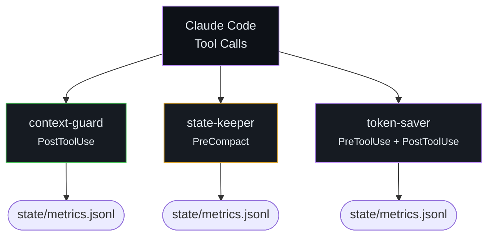
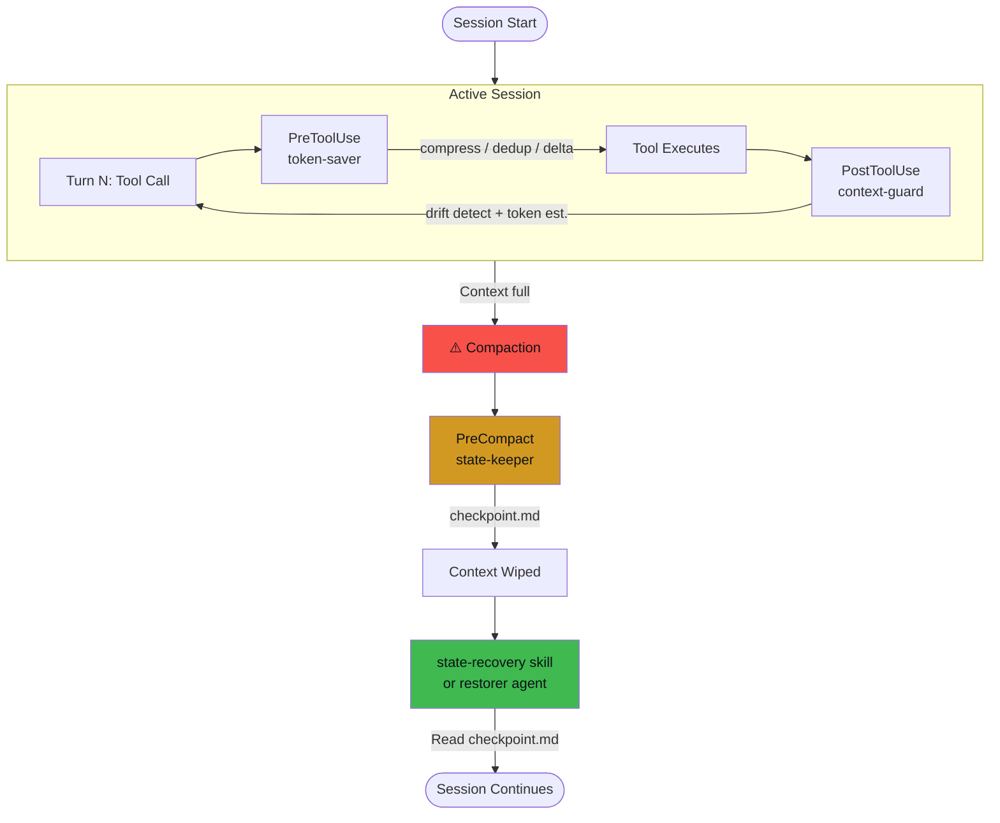
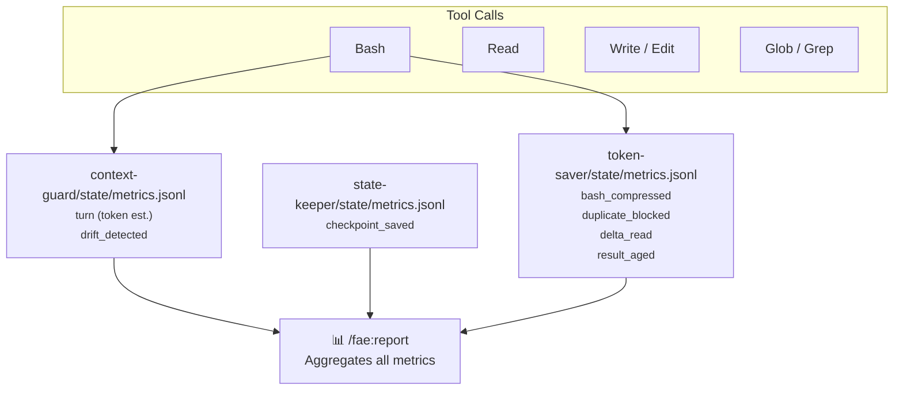

# Emu Architecture

> Auto-generated from codebase by `generate.py`. Run `python docs/architecture/generate.py` to regenerate.

## Interactive Explorer

Open [index.html](index.html) in a browser for the full interactive architecture explorer with tabbed diagrams and plugin component cards.

## High-Level Flow

Three plugins, three lifecycle phases, zero overlap.

## Session Lifecycle

From first tool call through compaction to context restoration.

## Data Flow

What events each plugin logs and how they feed into `/fae:report`.

## Files

| File | What |
|------|------|
| `generate.py` | Reads codebase, generates all diagrams + HTML |
| `index.html` | Interactive architecture explorer (dark theme, tabbed) |
| `highlevel.mmd` | High-level plugin flow (mermaid source) |
| `hooks.mmd` | Detailed hook bindings (mermaid source) |
| `dataflow.mmd` | Metrics data flow (mermaid source) |
| `lifecycle.mmd` | Session lifecycle (mermaid source) |
| `*.svg` | SVG renders (if mmdc installed) |
